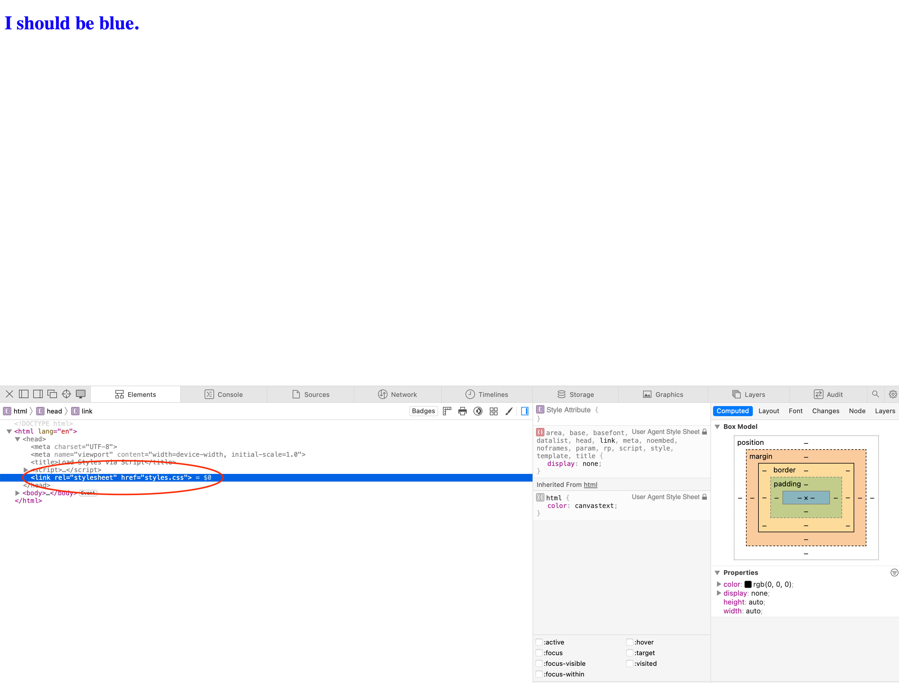

# Loading a Stylesheet via a Script

## This was purely for fun and I do not recommend actually doing this on a live website!

This all started by researching when it would be appropriate to load a script file in an HTML document's HEAD as opposed to its footer.

Most answers I was finding about Script placement were vague and only stated to include a Script in the HEAD "only when neccessary." Looking at what is normally included in an HTML HEAD I figured that it might be necessary to place a script there if the Script was used to determie Styles or Layout...Like if a Script was used for top level navigation or for mobile/Hamburger menus.

You will notice that there isn't a link to a stylesheet in index.html, but when you load the page in a browswer and inspect it with the browser's Dev Tools you will indeed find a stylesheet successfully linked via the JavaScript in the HEAD:

I have to stress, It is much easier (and far more correct!) to link a Stylesheet via 
<link rel="stylesheet" href="styles.css">, but this was a fun exercise to figure out and use JavaScript.

